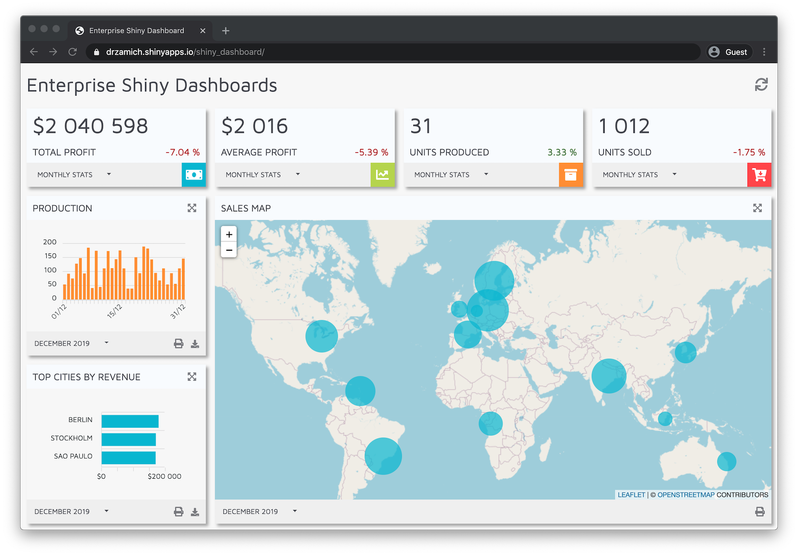

# Shiny Dashboard created with React.js
A Shiny application that leverages React.js to build the UI.


### Full-stack analytical solution:
1. Python scripts generating sample sales and production data.
2. R backend responsible for parsing the data, the heavy-weight calculations but also hosting the GUI.
3. React.js project which serves as app's frontend.
4. CI/CD pipeline in a form of GitHub Actions for automatic app deployment to shinyapps.io.

### Key features and advantages:
* App's frontend is built entirely with React. This makes the GUI development process extremely easy, especially when using the watch mode. It also gives access to an enormous number of JS libraries available in npm.
* Shiny and R are responsible for doing the calculations on large amounts on data. It all happens on the server and the results are sent to the GUI with the help of shinyjs. Thanks to that, the app is not a burden for user's machine and runs smoothly on mobile.
* Because of the fact that servers also have their limits, optimizations were made to decrease the load when multiple users use the app concurrently. Example: datasets are read only once per app's lifetime and this data is shared between user sessions.
* In this example, data is stored in and read from CSV files. It's easy however to alter this logic and establish a database connection for instance. Use the refresh button to get most current values without reloading the app.

### Live example
Play with the app live at [drzamich.shinyapps.io/shiny_dashboard](https://drzamich.shinyapps.io/shiny_dashboard/).

## Local installation
### Prerequisites
* R libraries: `shiny`, `shinyjs`, `R6`, `dplyr`, `data.table`, `jsonlite`
* [`npm`](https://nodejs.org/en/download/) command available in the command line

### Build the UI
Source code of the UI (a typical React project created with [Create React App](https://create-react-app.dev/)) is contained in the `ui` directory. A Shiny app needs _pure_ HTML, JS and CSS files, which are React build artifacts, in the `www` directory.

You firstly need to install React project's dependencies:
```
cd ui
npm install
```
And then build the UI:
```
npm run build
```
Build artifacts will  be automatically copied to the `www` directory.

### Generate sample data
Sample CSV files are contained in this repo but if you want it different, there is a Python script that prepares sample CSV files with data used in the Shiny app. Firstly make sure you have the libraries needed:
```
pip install Faker pandas
```

Generate the data by running the script
```
python data/fake_data_generator.py
```
You can modify the script to change date ranges and other characteristics.
## Usage
Open the `app.R` file in RStudio and click on the **Run App**  button.

## Development
### UI
To run the React app in development mode, run:
```
cd ui
REACT_APP_DEV_MODE=1 npm start
```

## Known issues
This project is not perfect. Check out the [list of Issues and TODOs](./TODOs.md) to see what's missing.
